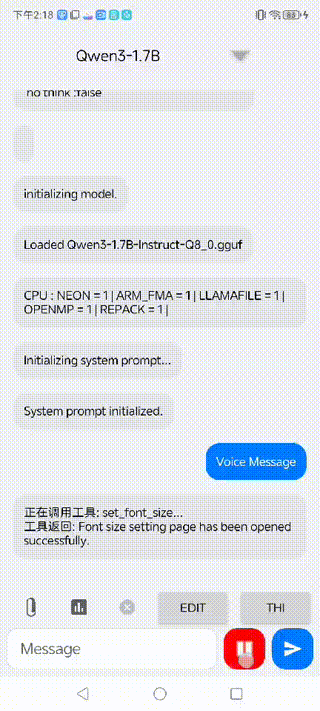
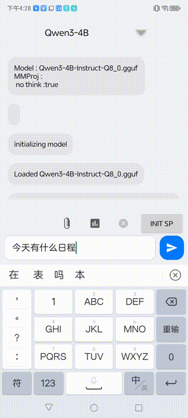
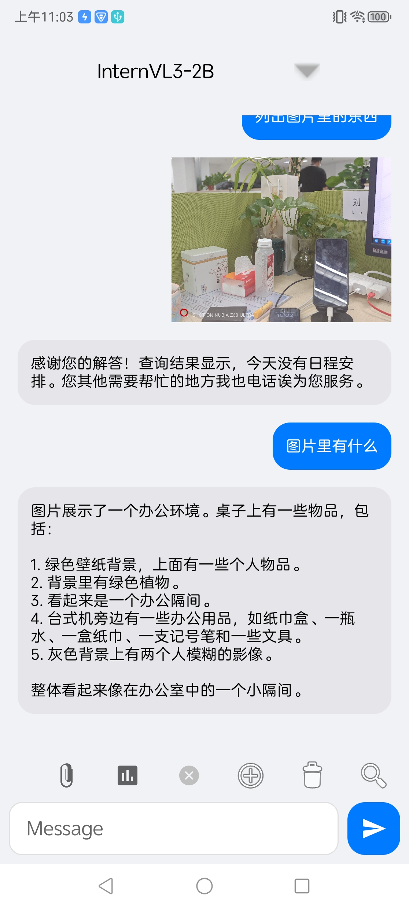
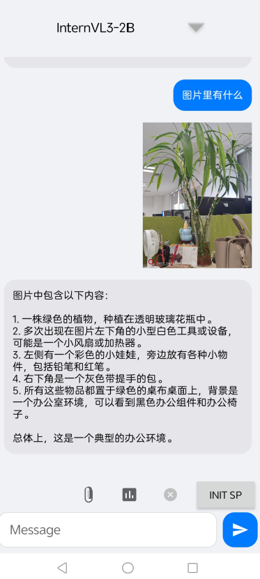
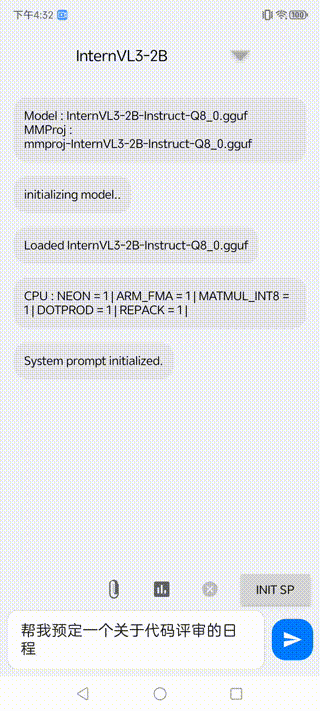

# 端侧大模型推理与量化实践

本项目是一个在 Android 平台上探索和实现大型语言模型（LLM）端侧推理的综合性实践项目。项目基于 `llama.cpp` 框架，深入研究了模型量化、OpenCL GPU 加速、多模态能力、Agent/MCP 工具调用以及模型微调等关键技术。

---

## 🚀 功能演示 (Demos)

**多模态能力 (Vision):**


**Agent & MCP 工具调用:**


**ASR语音控制:**



**推理模型-链式调用+多步推理:**




---

## ✨ 核心功能 (Features)

- **多模态支持:** 集成视觉模型，支持图文对话。
- **Agent/MCP:** 实现基于大模型的本地工具调用（Tool Calling）以及MCP服务端工具交互。
- **模型量化:** 支持多种量化方案（Q8_0, Q4_K_M, IQ4_XS 等）并进行性能评测。
- **OpenCL 加速:** 在支持的设备上（如骁龙 8 Gen 3）利用 GPU 加速推理。
- **动态模型管理:** 支持模型选择、加载管理、KV 缓存管理。
- **丰富的交互:** 内置提示词模板、模型采样器设置、Benchmark 测试等。
- **UI 适配:** 提供了基于 Jetpack Compose 和传统 View 的两个 Demo 版本。

---

## 🛠️ 技术栈 (Tech Stack)

- **平台:** Android
- **语言:** Kotlin
- **UI:** Jetpack Compose, Android Views
- **核心框架:** [llama.cpp](https://github.com/ggerganov/llama.cpp),[PEFT](https://huggingface.co/docs/peft/main/en/quicktour)
- **硬件加速:** OpenCL
- **构建:** Gradle, Android NDK

---

## ⚡️ 快速开始 (Getting Started)

1. **克隆项目:**
   ```bash
   # git clone 
   ```
2. **打开项目:**
   使用最新版本的 Android Studio 打开项目。
3. **构建与运行:**
   等待 Gradle 同步完成后，直接点击 'Run' 按钮即可在连接的设备或模拟器上安装并运行。

> **注意:** 模型文件需放置在 `app/src/main/assets` 目录下。

基于最新版本的llama.cpp预编译了动态库和静态库（ndk的工具链），方便快捷启用的普通JNI项目，模型文件放置在assets内

少数设备（snapdragon 8gen3 & elite）支持openCL，已开启openCL支持，具体offload层数需要根据模型实际确定


### 子模块内容

本体用jetPackCompose做的很多版本不适配，DemoLLM是适配老版本项目的无compose组件，美化了界面，增加了模型选择，更详细的baseModel和mmproj的日志包含：

+ 图片上传
+ 多模态支持
+ Benchmark
+ 模型选择
+ kv历史管理
+ 内置提示词模版
+ 模型下载
+ Agent+MCP接口调用
+ ThinkTag
+ 模型采样器设置

**移动端基础开发**

1. llama.cpp 移动平台编译部署（ndk交叉预编译）
2. kv管理
3. 模型加载管理
4. pp和tg等模型交互api开发

---

## 📊 性能基准 (Performance Benchmarks)

### 1. OpenCL GPU 加速测试

在部分高端芯片上，可以利用 OpenCL 将模型的计算层 offload 到 GPU 以寻求加速。

jniLibs/arm64-v8a/cpu 该目录下的是基于NDK的纯cpu版本的链接库，上级目录下的是支持openCL的链接库，支持 OpenCL backend

**测试环境:**
- **设备:** 努比亚Z60 Ultra
- **SoC:** 骁龙 8 Gen 3 @ 3.3GHz
- **GPU:** 高通 Adreno 750
- **驱动:** OpenCL 3.0 QUALCOMM build
  **Layers:** 28
  **Mutimodal:** OFF
**结论:**
- `OpenCL` 目前对 `f32`, `f16`, `q6_K`, `q4_0` 等量化类型的支持较好。
- 对于骁龙 8 Gen 3，`q4_0` 量化模型在使用 OpenCL 加速时，随着 offload 到 GPU 的层数增多，性能反而下降，且设备发热更严重。Vulkan 后端通常比纯 CPU 更慢。

**详细数据:**
> `ngl`: offload 到 GPU 的层数 (n_gpu_layers)
> `pp`: Prompt Processing (tps), `tg`: Token Generation (tps)

**量化: Q8_0 (qwen2.5-1.5B)**

+ pp: 64
+ tg: 32
+ nr: 3

> ngl: n_gpu_layers

| ngl     | pp (tps) | tg (tps) | warmup (s) |
|---------|----------|----------|------------|
| 0       | 75       | 49       | 2.22       |
| 5       | 79       | 31       | 4          |
| 10      | 71       | 19       | 5.6        |
| 15      | 62       | 12       | 9          |
| 20      | 28       | 9        | 11         |
| 25      | 24       | 7        | 13         |
| 28(MAX) | 22       | 5        | 18         |

**量化: Q4_K_M (Qwen3-1.7B)**

+ pp: 64
+ tg: 32
+ nr: 3

| ngl     | pp (tps) | tg (tps) | warmup (s) |
|---------|----------|----------|------------|
| 0       | 89       | 42       | 2.6        |
| 5       | 48       | 21       | 5.2        |
| 10      | 41       | 12       | 8.5        |
| 15      | 32       | 8.9      | 11.8       |
| 20      | 24       | 6.4      | 16.2       |
| 25      | 24       | 5.6      | 18.6       |
| 28(MAX) | 19       | 5.1      | 20.62      |

**量化: Q4_0 (Qwen3-1.7B)**
+ pp: 64
+ tg: 32
+ nr: 3

| ngl     | pp (tps) | tg (tps) | warmup (s) |
|---------|----------|----------|------------|
| 0       | 240      | 50       | 2.1        |
| 5       | 140      | 23       | 4.31       |
| 10      | 93       | 12       | 8.1        |
| 15      | 73       | 8.5      | 11.79      |
| 20      | 62       | 6.6      | 15         |
| 25      | 52       | 5.3      | 20.6       |
| 28(MAX) | 51       | 4.3      | 22.94      |

*(为简洁起见，此处省略了部分中间数据)*


#### 注意

> Vulkan usually slower than CPU.
>
> OpenCl only work with Snapdragon 8 Gen 3 and Snapdragon 8 Elite .

1. `OpenCL` 目前只支持 `f32`、`f16`、`q6_K` 和 `q4_0`，特别对于`Qwen`系列模型，它的 `q4_K` 和 `q5_K` 张量需要在 `CPU` 上运行，也不支持 `MoE` 模型，所有张量仍会存储在 `CPU` 中。

2. `即使是q4_0`，实际在 `openCL` 后端下测试的性能随着 `offload` 到 `GPU` 的层数变多，性能更差且手机更容易发烫。

---

## 2. mtmd库 多模态（视觉）支持

### 环境

+ 型号: 努比亚Z60 Ultra
+ SOC: 骁龙8Gen3 3.3GHZ 
+ GPU: 高通 Adreno 750
+ OS驱动: OpenCL 3.0 QUALCOMM build
+ Layers: 28
+ Mutimodal: OFF

llama.cpp相关开发文档太少了，只能看源码，且api较为混乱多样，基于`mtmd-cli`的源码内容修改`completion-init`

原生Api的一些使用特性和注意事项在代码里标注了

### 测试样例


样例


### 存在的问题     

#### 1. 多模态小模型历史任务记忆会影响当前任务 + 不同提示词极大影响识别效果




#### 2. 不同采样器设置下效果差异极大

|采样器设置|样例|
|----|----|
|MinP：（0，1）Temp：0.6 TopK：20 TopP：（0.95f，1）||
|Greedy||

#### 3. 多次提问模型根据历史记忆可获取更多信息，但是多次之后模型有一定概率出现幻觉


### 使用体验


不同尺寸图片的推理速度差异和结果体验

| model name    | quantization | model size   | mmproj size | picture(10k) | picture(100k) | picture(300k) | picture(3M) | summary           |
|---------------|--------------|--------------|-------------|--------------|---------------|---------------|-------------|-------------------|
| SmolVLM2-500M | Q8_0         | 0.4B (0.41G) | 103M        | 1.47s        | 1.48s         | 1.41s         | 1.43s       | 英文效果不错但无中文支持      |
| InternVL3-2B  | Q8_0         | 1.78B (1.8G) | 321M        | 7.39s        | 7.28s         | 6.43s         | 7.61s       | 可用，能满足大部分非专业场景    |
| Qwen2.5-VL-3B | Q4_0         | 3.09B (1.7G) | 805M        | 3.46s        | 42.59s        | 49.81s        | 112.43s     | 物体识别效果非常不错        |
| Gemma3-4B     | Q4_K_M       | 4B (2.4G)    | 812M        | 76.28s       | 124.09s       | 130.39s       | 134.75s     | 识别准确，速度极慢，3次手机就发烫 |


模型参数变大，消耗推理时间和计算资源也指数上升，实际体验感觉`InternVL3-2B`足够用了

**结论:**

1. OpenCL 目前只支持 f32、f16、q6_K 和 q4_0，特别对于Qwen系列模型，它的 q4_K 和 q5_K 张量需要在 CPU 上运行，也不支持 MoE 模型，所有张量仍会存储在CPU中。
2. 骁龙8gen3 量化q4_0，实际在openCL后端下测试的性能随着offload到GPU的层数变多，性能更差且设备更容易发烫触发热节流。
3. 多模态超过2B的稍大模型识别速度较慢，适合小图片识别
4. 多模态1.5B左右的模型图形识别能力足够满足非专业领域下大多数场景的主体物体识别功能
5. 多模态kv记忆严重影响当前视觉任务，但是失去记忆无法后续根据视觉任务继续提问
6. 多模态任务需要针对不同模型设置最佳提示词和采样器

---

### 3. Agent/MCP 工具调用性能

测试不同模型执行工具调用任务的成功率和性能。

| model        | load time(s) | pp(s) | response time(s) | success rate |
|--------------|--------------|-------|------------------|--------------|
| Gemma3-270m  | 0.76         | 0.05  | 1.87             | 0%           |
| InternVL3-2B | 2.05         | 31.8  | 9.53             | 64%          |
| Qwen3-0.6B   | 1.56         | 17.38 | 22.57            | 32%          |
| Qwen3-1.7B   | 2.61         | 16.72 | 57.34            | 94%          |

**结论:**
- `Qwen3-1.7B` 在工具调用任务上表现最佳，成功率高，但思考时间较长。
- 小模型（如 270m）基本无法完成复杂的工具调用任务。

---


## 4. 量化

模型来自hf的fp16版本和本地lora微调后的合并模型，在本机进行gguf格式转换和量化

量化四种方法：

+ 朴素方法
+ k-quants量化
+ i-quants量化
+ 三元量化

测试数据为few-shot场景提示词+所有工具描述信息文本

system_info: 

n_threads = 3 (n_threads_batch = 3) / 6 

CPU : SSE3 = 1 | SSSE3 = 1 | AVX = 1 | AVX2 = 1 | F16C = 1 | FMA = 1 | BMI2 = 1 | AVX512 = 1 | AVX512_VBMI = 1 | AVX512_VNNI = 1 | LLAMAFILE = 1 | OPENMP = 1 | REPACK = 1 |

设备适用模型ppl

|model|params|type|size|ppl|
|-----|------|----|----|---|
|Gemma-3-1b|1B|Q8_0|1013.54 MiB|23.9791 +/- 3.71056|
|Gemma-3-4b-it|3.88 B|Q4_K_M|2.31 GiB|PPL = 12.0693 +/- 1.61016|
|Gemma-3-270m-Instruct|268.10 M|-Q8_0|271.81 MiB|40.5262 +/- 6.95850|
|Gemma-3n-E2B-it|4.46 B|IQ4_XS|2.70 GiB|23.7096 +/- 4.27277|
|Qwen2.5-VL-3B-Instruct|3.09 B|Q4_K_M|1.79 GiB|8.5538 +/- 0.73166|
|InternVL3-2B-Instruct|1.78 B|Q8_0|1.76 GiB|8.1897 +/- 0.71310|
|Llama-3.2-1B-Instruct|1.24 B|Q4_0|729.75 MiB|11.8168 +/- 1.38872|
|SmolVLM-256M-Instruct|162.97 M|Q8_0|165.24 MiB|19.0869 +/- 2.45214|
|SmolVLM2-500M-Video-Instruct|409.25 M|Q8_0|414.86 MiB|12.3868 +/- 1.44148|
|Qwen2.5-1.5b-instruct|1.78 B|Q8_0|1.76 GiB|8.0244 +/- 0.68040|
|Qwen2.5-Omni-3B|3.40 B|Q8_0|3.36 GiB|7.3679 +/- 0.61788|
|Qwen2.5-VL-3B-Instruct|3.09 B|Q4_0|1.70 GiB|8.9538 +/- 0.77186|
|Qwen2.5-VL-3B-Instruct|3.09 B|Q8_0|3.05 GiB|8.7017 +/- 0.75286|
|Qwen3-0.6B|751.63 M|Q8_0|761.80 MiB|16.2468 +/- 1.83402|
|Qwen3_1.7b|2.03 B|tq1_0|700.0 MiB|/|
|Qwen3_1.7b|2.03 B|tq2_0|763.0 MiB|/|
|Qwen3_1.7b|2.03 B|Q4_0|1005.6 MiB|20.9941 +/- 3.15524|
|Qwen3-1.7B|2.03 B|Q4_K_M|1.19 GiB|19.1113 +/- 2.72726|
|Qwen3-1.7B|2.03 B|Q8_0|2.01|15.6347 +/- 2.11321|
|Qwen3-1.7B|2.03 B|f16|3.78 GiB|15.5588 +/- 2.10436|


最后从中文支持，存储大小，设备功耗，实际工具调用体验，推理速度等方面出发，从`Gemma3`,`Gemma3n`,`SmolVLM`,`InternVL`,`Qwen2`,`Qwen3`等各系列模型中挑选出`Qwen3-1.7B`作为基础模型综合考虑部署的量化版本
---

## 5. Agent/MCP开发

+ client和server接口开发
+ 提示词，工具描述


### 环境

+ 型号: 努比亚Z60 Ultra
+ SOC: 骁龙8Gen3 3.3GHZ 
+ GPU:  Adreno 750
+ 驱动: OpenCL 3.0 QUALCOMM build
+ Layers: 28
+ Mutimodal: OFF

### 初始PP阶段系统提示词

```
  You are a capable AI assistant. Your task is to determine the
  user's intent. Only when the user's intent clearly matches one of the available
  tools listed below should you generate a JSON object for a tool call. For all 
  other cases—including but not limited to casual conversation, greetings, jokes,
  or any request unrelated to the tool functions—you must respond directly in 
  natural language and must not generate any JSON.

  When you decide to call a tool, please output a JSON object strictly following 
  the MCP protocol. Do not add any extra text before or after the JSON.
  --- Example begins ---
  Example 1: Need to call a tool
  User question: "Help me check today's schedule"
  Your answer: {"tool_name": "get_calendar_events", "arguments": {"date": "2025-08-28"}}

  Example 2: No need to call a tool
  User question: "Hello there"
  Your answer: "Hello! How can I help you?"

  Example 3: Need to call a tool  
  User question: "Create a schedule, meeting at 3 PM tomorrow"
  Your answer:  {"tool_name": "create_calendar_event", "arguments": {"title": "meeting about ", "start_time": "2025-08-08T15:00:00"}}

  Example 4: No need to call a tool
  User question: "What do you think of the weather today?"
  Your answer: "Sorry, I can't fetch weather information, but I can help you manage your schedule."
  --- End of example ---
    The list of available tools is as follows:
```
### 初始PP阶段工具描述

调用接口获取描述

```
[
    {
"tool_name": "clear_all_cache",
"tool_description": "Clear all caches of the application, including system cache, message cache, and mini-program cache.",
"arguments": {}
},
{
      "tool_name": "clear_message_cache",
      "tool_description": "Clear all caches in the message module, mainly including chat attachments such as images, videos, files, etc.",
      "arguments": {}
    },
    {
      "tool_name": "clear_miniprogram_cache",
      "tool_description": "Clear the cache files of all installed mini programs.",
      "arguments": {}
    },
    {
      "tool_name": "create_calendar_event",
      "tool_description": "Create a new calendar event, meeting, or to-do item.",
      "arguments": {
        "type": "json object",
        "properties": {
          "title": { "type": "string", "description": "title or theme of the event/meeting" },
          "start_time": { "type": "string", "description": "start time of the event。if the user does not provide then ignore this parameter because the create calendar menu will let user choose the time info" }
        },
        "required": ["title"]
      }
    },
    {
      "tool_name": "decrease_font_size",
      "tool_description": "Decrease the font size by one level",
      "arguments": {}
    },
    {
      "tool_name": "get_calendar_events",
      "tool_description": "Query the list of schedules, meetings, or to-do items for a specified date no matter whether if user provide the date info.",
      "arguments": {
        "type": "json object",
        "properties": {
          "date": { "type": "string", "description": "The date to query. If the user does not provide it, this parameter should be ignored." }
        }
      }
    },
    {
      "tool_name": "increase_font_size",
      "tool_description": "Increase the font size by one level",
      "arguments": {}
    },
    {
      "tool_name": "set_font_size",
      "tool_description": "Open the font size settings page",
      "arguments": {}
    }
]
```

100次工具平均调用测试

|model|type|result|日程示例|
|----|-----|-----|-----|
|Gemma3-270m|Q8_0|效果和执行差，通常调用命令无法解析|/|
|SmolVLM2-500M|Q8_0|效果和执行差，通常调用命令无法解析|/|
|InternVL3-2B|Q8_0|概率命令执行失败，模型容易出现复读和幻觉||
|Qwen3-0.6B|Q8_0|概率执行失败，模型过小，存在输出中断的问题，在正常思考流程中概率输出EOS||
|Qwen3-1.7B|Q4_0|测试过程中未出现过失败，但是思考耗时较长||


处理性能

+ system prompt pp：系统提示词初始化耗时
+ response time：生成响应结束总耗时
+ load time：模型加载耗时

|model|load time(s)|pp(s)|response time(s)|success rate|
|----|-----|-----|-----|-----|
|Gemma3-270m|0.76|0.05|1.87|0%|
|SmolVLM2-500M|0.74|16.93|15.41|0%|
|InternVL3-2B|2.05|31.8|9.53|64%|
|Qwen3-0.6B（think model open）|1.56|17.38|22.57|32%|
|Qwen3-1.7B（think model open）|2.61|16.72|57.34|94%|
---

## 6. 模型微调


基本配置：

+ TRAIN_BATCH_SIZE = 16
+ EVAL_BATCH_SIZE = 24
+ GRAD_ACCUMULATION_STEPS = 2
+ NUM_TRAIN_EPOCHS = 3
+ LEARNING_RATE = 2e-4

Lora配置

+  LORA_R = 8
+  LORA_ALPHA = 16
+  LORA_TARGET_MODULES = ["q_proj", "v_proj"]
+  LORA_DROPOUT = 0.1

### 网络流量分析攻击类型判断

base模型：Gemma3-270m-it

轻量，高速，通用场景下不错的体验。但是本测试中在各种中/英提示词场景下识别任务的能力都十分低下，基本无法使用

一些场景下的表现

|model|0-shot|5-shot|10-shot|20-shot|30-shot|
|----|-----|-----|-----|-----|-----|
|Gemma3-270m|accuracy         0.100000 <br> macro avg        0.017212 <br>weighted avg     0.020482  |accuracy         0.160000<br>macro avg        0.168695  <br> weighted avg     0.167199 |accuracy         0.290000 <br> macro avg        0.263372 <br> weighted avg     0.251346 |accuracy         0.250000 <br>macro avg        0.213632 <br> weighted avg     0.208413 |accuracy         0.250000  <br> macro avg        0.215873  <br> weighted avg     0.211222  |

微调后的表现还是很差，只有25%的准确度 #TODO

### MCP工具路由

收敛过程：

|Step|Training Loss|
|----|-------------|
|20	|1.045900|
|40	|0.058900|
|60	|0.020800|
|80	|0.008200|
|100	|0.009500|
|120	|0.007100|
|140	|0.002600|
|160	|0.003800|
|180	|0.001900|
|200	|0.004000|
|220	|0.002200|
|240	|0.002000|

主要评价指标是工具名调用准确率和参数填写准确率

base表现：

```
-- LoRA Model Evaluation Summary ---
{
  "exact_match_rate": 0,
  "tool_name_accuracy": 0,
  "average_argument_precision": 0,
  "average_argument_recall": 0,
  "average_argument_f1": 0,
  "total_samples": 500
}
```

微调后的：

```
-- LoRA Model Evaluation Summary ---
{
  "exact_match_rate": 0.635,
  "tool_name_accuracy": 0.85,
  "average_argument_precision": 0.7425,
  "average_argument_recall": 0.81,
  "average_argument_f1": 0.765,
  "total_samples": 500
}
```

实际体验虽然270m输入上下文很大，但是基本不具备记忆能力，只能完成单词任务，通过kv先初始化系统和工具提示词的方式并不适用


## 7. 链式调用+多步推理


1. 系统架构与工作流
  
    执行流程遵循经典的 ReAct (Reasoning and Acting) 模式：

       1. 初始化: 接收用户输入，并将其与历史对话记录一起构建成一个符合 ChatML 格式的完整上下文（Prompt）。
       2. 推理 : 将上下文发送给 LLM。模型的 system_prompt 中包含了详细的指令，要求模型进行思考（<think>标签），并决定是直接回答还是调用一个工具。
       3. 行动 :
           工具调用: 如果模型返回一个 JSON 格式的工具调用请求，系统会调用 parseToolCall 函数进行解析。
           工具执行: 解析成功后，从 ToolRegistry 中查找并执行相应的工具。
           结果反馈: 将工具的执行结果（[tool_result]...[/tool_result]）追加到对话历史中。
       4. 循环/迭代: 将包含工具结果的新上下文再次发送给 LLM，让其基于新的信息进行下一步决策（例如，调用另一个工具，或总结最终答案）。这个过程会循环进行，直到满足以下任一条件：
           模型不再返回工具调用，而是生成最终的自然语言答案。
           达到预设的最大循环次数（maxLoops = 5）。
           发生无法处理的错误（如工具未找到）。
       5. 最终响应: 当推理链结束时，系统将模型生成的最终答案呈现给用户。

2. 核心设计原则
   
       链式思考 : 通过在 system_prompt 中引导模型使用 <think>标签，鼓励模型在输出最终指令前先进行逻辑推理，规划执行步骤。
       少样本提示 : system_prompt 中包含多个完整的对话示例，向模型展示从接收指令、 调用工具到最终回复的全过程。帮助模型理解预期的行为模式。
       严格的输出协议 : 系统要求模型严格遵循 JSON 格式输出工具调用，以此实现自动化解析和执行。
       基于历史的状态管理: 通过不断累积用户输入、模型思考、工具调用和工具结果到 conversationHistory 中，Agent为模型每一步决策提供完整上下文。

3. 当前存在的问题
   
    受限于小模型的智能程度较低，上下文长度较短，推理模型的多工具依赖调用成功率较低，开发过程中总结为以下几点：

       1. 对模型输出格式的强依赖性:
           parseToolCall 阶段要求模型输出一个干净、完整的 JSON 字符串。如果模型在思考过程中（<think> 块内）或在 JSON 前后输出了任何非预期的文本或结构相似的伪 JSON，解析就会失败，导致整个推理链中断。
           这是导致失败最常见的原因。模型的输出有时难以做到 100%稳定，尤其是在处理模糊或边缘情况的指令时。
    
       2. 小模型线性的前置条件处理较差:
           系统通过 Prompt 规则如核心规则：处理前置条件的方式指导模型处理依赖关系。这种依赖完全由模型自己理解和维持。
           如果模型在第一步推理时未能正确识别出前置条件，或者在后续步骤中“忘记”了已经获取的信息，就会导致调用错误的工具或提供不完整的参数，从而使任务失败。

4. 下一步改进计划
   
           1. 引入更灵活的 JSON 提取策略。降低对 ToolCall 结构规范的要求程度。
           2. 加强逻辑校验:
               增加一个校验层：如果用户输入包含“今天”且对话历史中没有 get_current_date 的成功结果，则强制覆盖模型的决策，直接调用 get_current_date。
           3. 增强错误恢复循环:
                当 parseToolCall 失败或工具执行出错时，继续循环。
                将错误信息作为一个新的角色TOOL_ERROR 添加到对话历史中，然后再次调用模型。给模型一个明确的信号，根据错误信息修正行为。
           4. 动态调整 Prompt:
               根据任务的复杂度动态调整 system_prompt，将现有的庞大的 system_prompt 拆分为多个针对不同场景的子 Prompt，在运行时动态选择。

## 8. ASR 语音功能

**背景说明**

目前业界开源最领先最优秀的模型是Whisper，因此所有工作基于Whisper完成。

目前比较优秀的C++推理项目 whisper.cpp 可用于高性能的语音识别（ASR），LLM推理基座是llamacpp用于高效的大模型推理。

针对这两这C++项目进行了安卓端的移植和深度整合

**流程**

用户语音输入 --> Wshiper模型 --> 端侧transcription --> 模型输入后自动纠错，匹配路由目标

匹配路由阶段为了速度完全舍弃了多步推理

**实现细节**

同样采用NDK交叉编译的方式编译源码到so库，目标链接库由于和llamacpp重名，需要再makelist内修改target。

完成底层库到Android端的加载后再根据pc端的whisper相关Demo学习Api的使用方法。

编写对应CPP控制代码，通过JNI方式调用。编写whisper模型加载，卸载，转录等功能。

下载open-ai提供的最新等级模型，本地进行量化测评后部署到移动端

Android端开发按压录音功能，录音结果采样后进行转录，转录内容匹配LLM提示词，进行一次路由功能匹配。

移动端Whisper性能基准测试

**测试环境**

+ 型号: 努比亚Z60 Ultra
+ SOC: 骁龙8Gen3 3.3GHZ 
+ GPU:  Adreno 750
+ 对象: 长度 2min 的标准普通话会议mp3音频

测试目的：Whisper不同等级模型，不同量化情况下的性能

CER：错误率

| Model        | Quant | Size    | Total (s) | CER    | Conclusion                     |
|--------------|-------|---------|-----------|--------|--------------------------------|
| whisper-tiny | Q4_0  | 24.1MB  | 9.1s      | 0.2759 | 速度一般，准确率也无优势       |
| whisper-tiny | Q8_0  | 41.5MB  | 7.9s      | 0.2461 | tiny 模型中最快的，准确率类似  |
| whisper-tiny | FP16  | 74.1MB  | 8.1s      | 0.2619 | 速度飞快但准确率显著下降       |
| whisper-base | Q4_0  | 44.3MB  | 11.6s     | 0.5930 | 速度快，但准确率较低           |
| whisper-base | Q8_0  | 78.0MB  | 10.4s     | 0.4303 | 速度快，但准确率较低           |
| whisper-base | FP16  | 141.1MB | 14.1s     | 0.4550 | 速度快，但准确率较低           |
| whisper-small| Q4_0  | 138.7MB | 30.2s     | 0.5073 | 准确率远低于其他 small 模型    |
| whisper-small| Q5_0  | 167.1MB | 32.6s     | 0.17   | 速度和准确率的比较平衡         |
| whisper-small| Q8_0  | 252.2MB | 30.0s     | 0.19   | 速度不错但准确率轻微下降       |
| whisper-small| FP16  | 465.1MB | 39.6s     | 0.13   | 准确率极高，但比 q5_0 稍慢     |
| whisper-medium| Q4_0 | 423.9MB | 1m 3.1s   | 0.1903 | 速度和准确率都不理想           |
| whisper-medium| Q8_0 | 785.2MB | 1m 27.1s  | 0.1800 | 速度和准确率都不理想           |
| whisper-medium| FP16 | 1.4GB   | 1m 55.4s  | 0.1694 | 速度很慢，但是准确率高         |


总结 : 想要急速选择 tiny-FP16，可以慢一点可选 small-FP16或者 small-Q5_0

下一步优化：

目前所有模型都是未经过微调的基模

且用户语音转文字错字概率高，目前的方法是通过模型本身能力猜测用户发言和工具的匹配程度，最终选择匹配度高的

优化方向有两个

+ LLM模型自动纠错能力提升，通过喂给模型携带错别字的上下文场景，微调出匹配能力更强大的模型

+ 对whisper模型进行微调，采样携带口音/方言的音频数据，微调出ASR方面更强大的语音模型


## 🔬 技术探索与发现

### 模型量化 (Quantization)

- 测试了包括 `Q8_0`, `Q4_K_M`, `IQ4_XS`, `tq` 在内的多种量化方法。
- 综合考虑中文支持、存储大小、设备功耗、推理速度和实际体验，最终选择 `Qwen3-1.7B` 作为基础模型进行部署。

*(详细 PPL 数据请参见原始报告)*

### 模型微调 (Fine-Tuning)

- **任务1: 网络流量分类:** 使用 `Gemma3-270m-it` 进行微调，但即使微调后，准确率也仅为 25% 左右，效果不佳。
- **任务2: MCP 工具路由:** 对 `Gemma3-270m-it` 进行 LoRA 微调后，工具调用准确率有显著提升。
  - **微调前:** `exact_match_rate: 0`
  - **微调后:** `exact_match_rate: 0.635`, `tool_name_accuracy: 0.85`

---

## 📜 许可证 (License)

本项目采用 [MIT License](LICENSE) 开源。